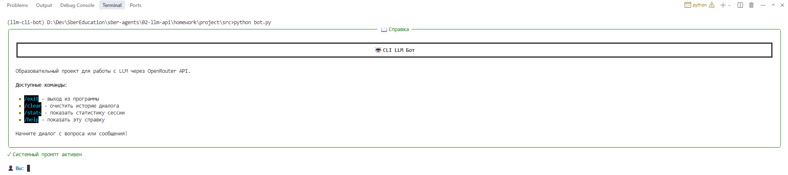
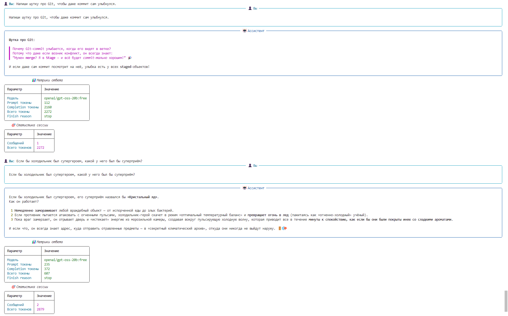
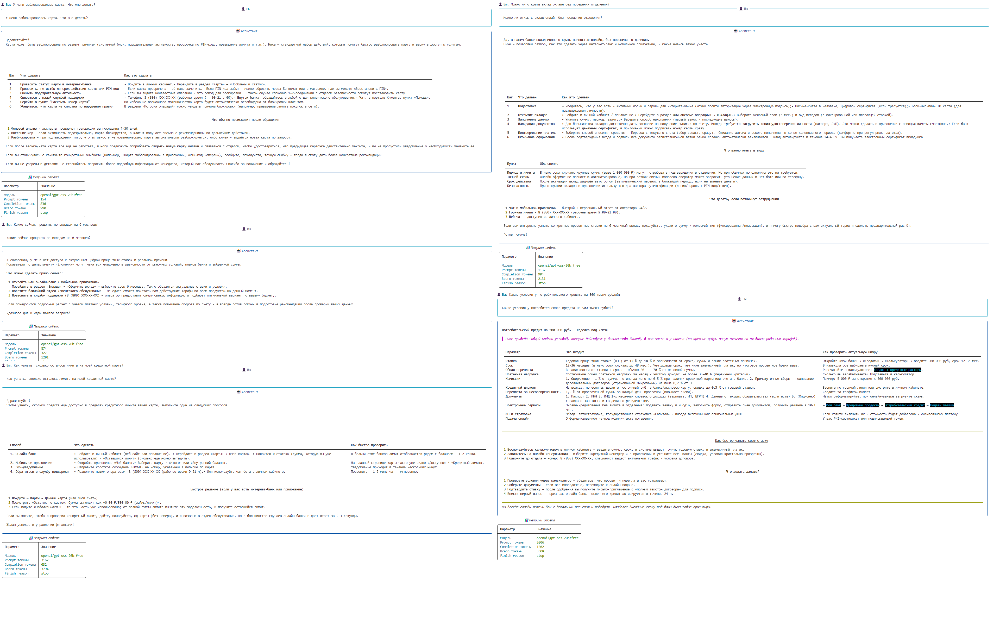

# Report

## 1. Настройка и запуск (Задание 1)

### Скриншот успешного запуска



### Пример простого диалога с метриками



## 2. Системные промпты (Задание 2)

### Промпт: Банковский консультант

**Текст системного промпта:**
```
Ты — профессиональный консультант банка. Помогай клиентам с вопросами о счетах, картах, кредитах и вкладах. Отвечай вежливо, профессионально и по существу. Если не знаешь точного ответа — честно признайся и предложи обратиться к специалисту.
```

**Пример диалога:**



**Наблюдения:**

Бот следует инструкциям. Он вежливо и профессионально отвечает на вопросы о банковских услугах, соблюдает указанный стиль общения.

**Что работает хорошо:**
- Бот четко следует заданной роли банковского консультанта
- Соблюдает профессиональный и вежливый тон общения
- Дает структурированные ответы по существу

**Что можно улучшить:**
- Можно адаптировать под конкретный банк с указанием его особенностей и продуктов
- Добавить конкретную информацию о тарифах и условиях, если вопрос требует такой детализации

## 3. Сравнение моделей (Задание 3)

Сравнение проводилось на системном промпте банковского помощника. Тестировались модели: **GPT-3.5-turbo** и **Claude-Sonnet-4.5**.

### 1. Формат и структура ответа

**GPT-3.5-turbo:**
- Очень детализированная структура: таблицы «Причина — что делать», «Что важно знать — как проверить», пошаговые инструкции
- Даёт конкретные действия с временными оценками («через приложение: 5–10 минут», «по телефону: 30–120 минут»)
- Чётко разделяет разные ситуации (блокировка карты, кредит на авто)
- Приводит рекомендации «если нужно ускорить процесс», «что подготовить заранее»
- Имеет более «учебный» стиль — читателю почти как в инструкции по эксплуатации

**Claude-Sonnet-4.5:**
- Структура ответа проще и компактнее: шаги пронумерованы, таблицы есть, но меньше деталей
- Менее многоуровневое объяснение; упоминает ключевые параметры, но не даёт столько временных оценок и «лайфхаков»
- Стиль ближе к профессиональному консультанту: формально, лаконично, без лишней детализации
- Хорошо подходит для быстрого понимания, но при этом не раскрывает всех нюансов, которые GPT-3.5 даёт (например, временные рамки восстановления карты)

### 2. Содержание по темам

**Блокировка карты:**
- **GPT-3.5:** более практическая, с советами, что делать прямо сейчас, как ускорить процесс, какие документы подготовить
- **Claude:** более общий обзор, шаги понятны, но меньше конкретики (например, нет указания на «поминальное подтверждение» или точного времени восстановления)

**Автокредит:**
- **GPT-3.5:** охватывает почти все детали — ставки, комиссии, страхование, обеспечение, варианты платежей, досрочное погашение. Даёт рекомендации по расчетам и проверке условий
- **Claude:** основные параметры, понятны ключевые моменты, но нет таких подробных советов о скрытых комиссиях, проверках APR, детальном разборе страхования

### 3. Стиль и подход

- **GPT-3.5-turbo** — «пошаговый гид», учебный стиль, больше деталей, кажется чуть «загруженным» информацией. Подходит для пользователей, которые хотят почти полное руководство по ситуации

- **Claude-Sonnet-4.5** — «профессиональный консультант», формально, компактно, легко читается. Подходит для быстрого ответа клиенту, меньше перегружает, но требует, чтобы пользователь сам разбирался с деталями

### 4. Заключение

- Оба ответа соответствуют промту (вежливо, профессионально, честно)
- Отличие в глубине и детализации: GPT-3.5 даёт очень подробный, почти «учебный» вариант, Claude — более лаконичный и формальный
- Если цель — тестировать точность и полноту информации, GPT-3.5 выигрывает
- Если цель — оперативный ответ для реального клиента, Claude может быть более «читабельным» и быстрым

**В целом, оба ответа хороши, но подход разный: GPT-3.5 более практичный и детализированный, Claude — компактный и формальный.**

## 4. Управление историей (Задание 4)

### Описание реализованной стратегии

Была реализована **Стратегия 1: Ограничение по количеству сообщений**.

Алгоритм работы:
- После каждого добавления сообщения в историю выполняется проверка её длины
- Сохраняется системный промпт (если он задан) — он всегда остаётся в истории
- Оставляются только последние 10 сообщений пользователя и ассистента
- Старые сообщения автоматически удаляются

Преимущества:
- Простая реализация без дополнительных API-вызовов
- Эффективное управление использованием токенов
- Гарантирует, что история не превысит лимит контекста модели
- Системный промпт сохраняется, обеспечивая консистентность поведения бота

Ограничения:
- Может теряться важный контекст из начала диалога при длинных беседах
- Не реализована суммаризация истории (требовала бы дополнительные переменные для хранения полной истории, мне было лень их делать, поэтому будет только такой вариант)

### Фрагмент кода

```python
def add_message(self, role: str, content: str):
    """Добавить сообщение в историю диалога."""
    self.conversation_history.append({
        "role": role,
        "content": content
    })
    
    # Ограничиваем историю: системный промпт + последние 10 сообщений
    if SYSTEM_PROMPT:
        # Находим системный промпт
        system_message = None
        user_messages = []
        
        for msg in self.conversation_history:
            if msg["role"] == "system":
                system_message = msg
            else:
                user_messages.append(msg)
        
        # Формируем ограниченную историю: системный промпт + последние 10 сообщений
        if system_message:
            self.conversation_history = [system_message] + user_messages[-10:]
        else:
            self.conversation_history = user_messages[-10:]
    else:
        # Если системного промпта нет, просто оставляем последние 10 сообщений
        self.conversation_history = self.conversation_history[-10:]
```

