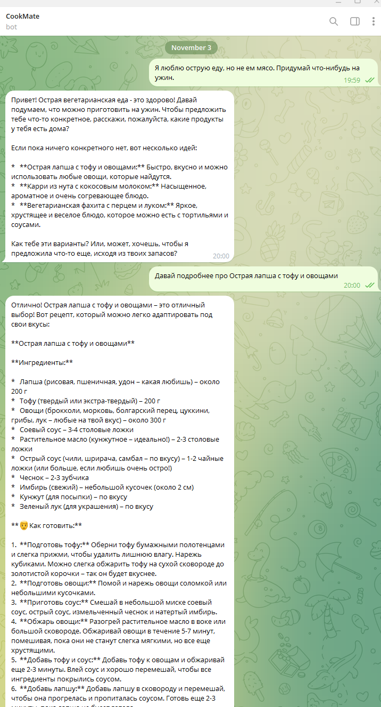

# Отчёт о выполнении задания: AIDD Bot

## Описание проекта

**AIDD Bot** — интеллектуальный Telegram-бот для кулинарных советов и помощи в готовке, реализованный на базе LLM через провайдера OpenRouter. Бот ведёт контекстный диалог, предлагает рецепты и кулинарные решения, поддерживает историю сообщений и периодическую суммаризацию для эффективного управления долгосрочным контекстом.

## Выбранная роль ИИ-ассистента и обоснование

**Роль:** Кулинарный помощник с поддержкой контекста диалога

**Обоснование:** 
- Роль кулинарного помощника позволяет боту помогать пользователю готовить, планировать блюда и использовать продукты рационально на основе имеющихся ингредиентов и предпочтений
- Узкая специализация обеспечивает высокое качество ответов в кулинарной сфере: от предложения рецептов до объяснения техник и сочетаний вкусов
- Встроенная поддержка контекста через окно последних 20 сообщений и суммаризацию позволяет запоминать предпочтения пользователя (вегетарианство, диеты, любимые блюда) и предлагать персонализированные решения
- Дружелюбный и воодушевляющий тон общения делает взаимодействие приятным и мотивирующим для экспериментов на кухне

## Реализованные возможности

- [x] Подключение к Telegram через aiogram 3.x с использованием polling
- [x] Интеграция с LLM через OpenRouter с использованием официального OpenAI-клиента
- [x] Файловое хранилище контекста диалога (текстовые файлы по `chat_id`)
- [x] Окно истории размером 20 сообщений для передачи в промпт
- [x] Автоматическая суммаризация каждые 20 сообщений с слиянием предыдущих сводок
- [x] Команда `/start` — проверка готовности бота
- [x] Команда `/status` — информация о количестве сообщений и наличии сводки
- [x] Команда `/reset` — очистка истории и сводок текущего чата
- [x] Базовое логирование метаданных запросов и ошибок
- [x] Обработка ошибок с короткими пользовательскими сообщениями
- [x] Опциональная повторная попытка при сетевых ошибках
- [x] Конфигурация через переменные окружения (`.env`)

## Технологический стек

- **Язык:** Python 3.12+
- **Управление зависимостями:** `uv`
- **Telegram-бот:** aiogram 3.x
- **LLM-клиент:** OpenAI client v1.51+
- **Провайдер LLM:** OpenRouter (`openrouter/auto`)
- **Сборка/запуск:** Make (targets: `install`, `run`, `clean`)
- **Хранение данных:** Файловая система (текстовые файлы в директории `data/`)
- **Логирование:** Стандартный модуль `logging` (stdout)

## Инструменты AI-driven разработки

### Используемая AI-coding IDE
**Cursor** — специализированный IDE с встроенной поддержкой LLM для автодополнения, рефакторинга и генерации кода на основе естественного языка.

### Используемые LLM модели для генерации документации и кода
- **Claude 3.5 Sonnet** (через Cursor) — для генерации кода, рефакторинга и интерактивной помощи в разработке
- **Model router (openrouter/auto)** — в самом боте для ответов пользователям и суммаризации

## Скриншот работы



## Процесс разработки: основные вызовы и решения

### Вызов 1: Архитектура хранения контекста
**Проблема:** Нужно было обеспечить простое, не требующее базы данных решение для хранения истории диалога и суммаризаций.

**Решение:** Использована файловая система с простыми текстовыми файлами:
- `messages.txt` — лог сообщений (timestamp + role + content)
- `summary.txt` — текущая сводка
- `meta.json` — метаданные (счётчик сообщений)

Преимущества: простота, переносимость, работает без дополнительных зависимостей.

### Вызов 2: Суммаризация и управление долгосрочным контекстом
**Проблема:** Как поддерживать релевантность ответов в длинных диалогах без передачи всего контекста в каждый запрос.

**Решение:** Реализована стратегия скользящего окна (20 сообщений) + периодическая суммаризация:
- Каждые 20 сообщений выполняется LLM-суммаризация
- Новая сводка объединяет предыдущую и последний блок
- В промпт передаётся краткая сводка + окно последних 20 сообщений

Это позволяет удерживать важную информацию без экспоненциального роста токенов.

### Вызов 3: Интеграция с OpenRouter через OpenAI client
**Проблема:** Нужно было использовать стандартный OpenAI client с кастомным `base_url` для OpenRouter.

**Решение:** Простая конфигурация:
```python
self._client = OpenAI(api_key=cfg.openrouter_api_key, base_url=cfg.openrouter_base_url)
```

Благодаря совместимости API никаких специальных адаптеров не потребовалось.

### Вызов 4: Обработка ошибок и устойчивость
**Проблема:** Сбои LLM или сети не должны ломать работу бота.

**Решение:** 
- Обёртка LLM-запросов в try-except с коротким пользовательским сообщением
- Опциональный ретрай на сетевые ошибки
- Логирование метаданных (без PII) для отладки

## Что узнал нового в процессе AI-driven разработки

1. **Эффективность итеративного согласования с LLM:** Работа по принципу "предложить решение → получить согласование → реализовать" оказалась эффективнее, чем полная самостоятельная генерация кода. Это снижает риск неправильной интерпретации требований.

2. **Важность детального технического видения (`docs/vision.md`):** Наличие чёткого vision-документа помогло удерживать фокус на MVP, избегать оверинжиниринга и не уходить в фичи, не согласованные с требованием KISS/YAGNI.

3. **LLM-ассистенты не заменяют архитектурное мышление:** Хотя AI отлично генерирует код, ключевые архитектурные решения (файловая система vs БД, стратегия суммаризации) остались за человеком. LLM помог детализировать и реализовать, но не спроектировал.

4. **Важность ограниченного контекста:** Ограничение контекста диалога (окно 20 сообщений) не только экономит токены, но и улучшает качество ответов модели, так как она фокусируется на релевантной информации.
