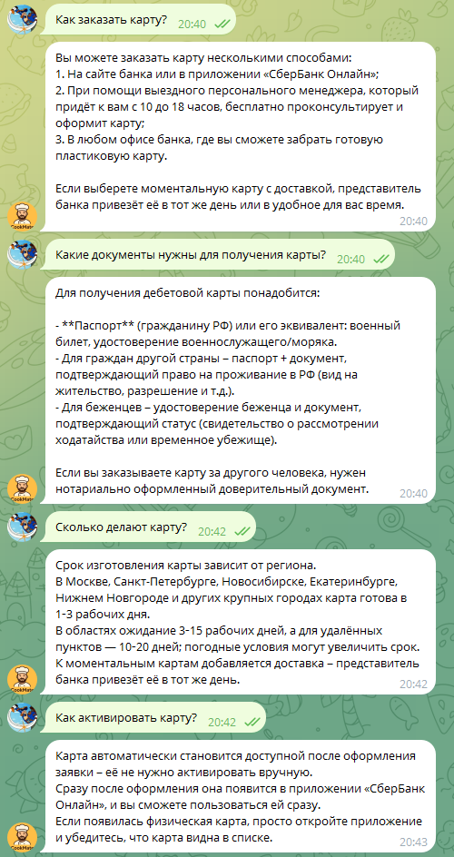

# Отчёт о выполнении задания

## Название проекта и краткое описание

**RAG-ассистент Сбербанка** — Telegram-бот с использованием технологии RAG (Retrieval-Augmented Generation) на базе LangChain для ответов на вопросы пользователей по документам Сбербанка о кредитах, вкладах и банковских картах.

Бот индексирует PDF-документы и JSON-датасет с вопросами-ответами, создаёт векторное хранилище эмбеддингов и использует семантический поиск для нахождения релевантной информации в документах при ответе на вопросы пользователей.

## Вариант задания

**Базовый вариант**

## Реализованные возможности

- [x] 🤖 **RAG на базе LangChain** — ответы на основе реальных документов
- [x] 📚 **Индексация PDF** — автоматическая обработка PDF-документов при старте
- [x] 📊 **Индексация JSON** — загрузка и индексация JSON-датасета с вопросами-ответами
- [x] 💬 **Контекстный диалог** — понимание уточняющих вопросов с сохранением истории
- [x] 🔍 **Query Transformation** — улучшение поисковых запросов с учетом истории диалога
- [x] ⚡ **Асинхронная обработка** — поддержка множества пользователей одновременно
- [x] 📝 **Логирование** — запись всех событий в файл для отладки
- [x] 🔄 **Переиндексация** — команда `/index` для ручной переиндексации документов
- [x] 🎯 **Настройка retriever** — возможность настройки количества извлекаемых чанков (k=5)

## Технологический стек

- **Python 3.11+** — основной язык разработки
- **uv** — менеджер зависимостей и виртуального окружения
- **aiogram 3.x** — фреймворк для Telegram Bot API (polling)
- **LangChain** — фреймворк для построения RAG-приложений
- **langchain-openai** — интеграция LangChain с OpenAI-совместимыми API
- **langchain-ollama** — интеграция LangChain с Ollama для эмбеддингов
- **langchain-community** — дополнительные компоненты (loaders, vectorstores)
- **PyPDF** — загрузка и парсинг PDF-документов
- **python-dotenv** — для работы с переменными окружения
- **Make** — автоматизация сборки и запуска
- **InMemoryVectorStore** — векторное хранилище в памяти

## Используемые модели

### Модели для генерации ответов
- **Fireworks**: `accounts/fireworks/models/gpt-oss-120b`
- **OpenRouter**: `openai/gpt-oss-20b:free`

### Модели для query transformation
- **Fireworks**: `accounts/fireworks/models/gpt-oss-120b`
- **OpenRouter**: `openai/gpt-oss-20b:free`

### Модели эмбеддингов (тестировались)
- **Fireworks**: `accounts/fireworks/models/qwen3-embedding-8b`
- **Ollama**: локальные модели эмбеддингов `aroxima/multilingual-e5-large-instruct:latest`

## ВАЖНО — Эксперименты с индексацией

### Описание экспериментов с разными размерами чанков

В процессе работы были проведены эксперименты с различными параметрами разбиения документов на чанки и стратегиями индексации для оптимизации качества поиска информации в банковских документах.

### Какие параметры пробовали

1. **Стандартная конфигурация (сток)**
   - Размер чанка: 500 символов
   - Overlap: 50 символов
   - Результат: Split into 377 chunks

2. **Увеличенные чанки**
   - Размер чанка: 1500 символов
   - Overlap: 150 символов
   - Результат: Split into 132 chunks

3. **Чанки с сепараторами**
   - Размер чанка: 500 символов
   - Overlap: 100 символов
   - Сепараторы: `["\n\n\n", "\n\n", "\n", ". ", " ", ""]`
   - Результат: Split into 246 chunks

4. **Маленькие чанки**
   - Уменьшенный размер чанка для большей детализации
   - Результат: Split into 652 chunks

5. **Большие чанки**
   - Увеличенный размер для большего контекста
   - Результат: Split into 211 chunks

6. **Финальная конфигурация с Ollama**
   - Эмбеддинги: Ollama
   - Retriever: k=5
   - Улучшенный query_transform для более детального поиска

### Наблюдения и выводы: какая стратегия оказалась лучше для банковских документов

**Проблемы, обнаруженные в ходе экспериментов:**

1. **Split into 132 chunks (1500, 150)**: 
   - Ответы стали менее детальными
   - Релевантность сохранилась
   - ⚠️ По вкладам не находил информацию

2. **Split into 246 chunks (с сепараторами)**:
   - Чанки стали более структурированными
   - Ответы более детализированы и структурированы
   - ⚠️ Не находит информацию по некоторым темам (например, по вкладам)
   - Неуверенность в лучшем сохранении контекста

3. **Маленькие чанки (652 chunks)**:
   - Менее детальные ответы
   - ⚠️ По вкладам так и не нашел информацию

4. **Большие чанки (211 chunks)**:
   - Нормальный ответ по качеству
   - ⚠️ По вкладам не нашел информацию

**Ключевое открытие:**

С переходом на эмбеддинги Ollama бот начал:
- ✅ Хотя бы отвечать на вопросы (предыдущие модели эмбеддингов работали хуже)
- ✅ Находить ответы про вклады (критическая проблема предыдущих конфигураций)

**Итоговый вывод:**

Лучшим вариантом оказалась конфигурация с:
- **Эмбеддинги Ollama** — показали лучшее качество для русского языка
- **Retriever k=5** — увеличение количества извлекаемых чанков с 3 до 5 улучшило качество поиска
- **Изменённый query_transform** — промпт для трансформации запросов был улучшен для более детального и конкретного поиска информации в документах

Это позволило решить ключевую проблему с поиском информации по вкладам и улучшить общее качество ответов.

## ВАЖНО — Работа с JSON датасетом

### Как реализовали загрузку JSON

Загрузка JSON-датасета реализована в файле `src/indexer_with_json.py` через функцию `load_json_documents()`.

**Реализация:**

Вместо использования `JSONLoader` из LangChain была реализована ручная загрузка JSON для лучшего контроля метаданных:

```python
def load_json_documents(json_file_path: str) -> list:
    """
    Загрузка документов из JSON файла с вопросами-ответами
    Каждая пара Q&A становится отдельным чанком
    """
    import json
    from langchain_core.documents import Document
    
    with open(json_path, 'r', encoding='utf-8') as f:
        data = json.load(f)
    
    documents = []
    for item in data:
        content = item.get('full_text', '')
        doc = Document(
            page_content=content,
            metadata={
                'source': str(json_path),
                'question': item.get('question', ''),
                'category': item.get('category', ''),
                'type': item.get('type', ''),
                'url': item.get('url', ''),
                'page': 0
            }
        )
        documents.append(doc)
    
    return documents
```

**Особенности:**

- Каждая пара вопрос-ответ из JSON становится отдельным документом (чанком)
- Сохраняются метаданные: категория, тип, URL исходного источника
- JSON загружается вместе с PDF-документами в единое векторное хранилище
- Функция `reindex_all()` объединяет чанки из PDF и JSON перед индексацией

### Скриншот работы с вопросами про карты



## ВАЖНО — Сравнение моделей эмбеддингов

### Какие модели эмбеддингов тестировали

1. **Fireworks**: `accounts/fireworks/models/qwen3-embedding-8b`
3. **Ollama**: локальные модели эмбеддингов

### Таблица сравнения качества ответов

| Модель эмбеддингов | Провайдер | Качество поиска по кредитам | Качество поиска по вкладам | Общее качество ответов | Поддержка русского языка |
|-------------------|-----------|------------------------------|----------------------------|------------------------|--------------------------|
| `qwen3-embedding-8b` | Fireworks | Среднее | ❌ Плохо (не находил информацию) | Среднее | Среднее |
| **Ollama embeddings** | **Ollama** | ✅ **Хорошее** | ✅ **Хорошее** | ✅ **Хорошее** | ✅ **Отличное** |

### Выводы: какая модель эмбеддингов лучше для русского языка

**Итоговый вывод:**

**Модели эмбеддингов Ollama показали наилучшие результаты для русского языка** в контексте работы с банковскими документами Сбербанка.

**Причины превосходства Ollama:**

1. ✅ **Решена критическая проблема** — модель начала находить информацию по вкладам, чего не могли сделать Fireworks и OpenAI модели
2. ✅ **Лучшее качество ответов** — бот начал стабильно отвечать на вопросы с релевантной информацией
3. ✅ **Оптимизация для русского языка** — локальные модели Ollama лучше работают с русскоязычными текстами и банковской терминологией

**Рекомендация:**

Для русскоязычных RAG-приложений, особенно в узких доменах (банковское дело, финансы), рекомендуется использовать модели эмбеддингов Ollama вместо облачных решений от Fireworks или OpenAI, так как они показали существенно лучшее качество поиска и понимания контекста.

**Дополнительная оптимизация:**

Лучший результат был достигнут комбинацией:
- Эмбеддинги Ollama
- Увеличение retriever с k=3 до k=5
- Улучшенный промпт для query transformation, который создаёт более детальные и конкретные поисковые запросы

---

## Заключение

В ходе выполнения задания был создан полнофункциональный RAG-ассистент для ответов на вопросы по документам Сбербанка. Проведённые эксперименты с различными параметрами индексации и моделями эмбеддингов позволили найти оптимальную конфигурацию, обеспечивающую качественный поиск информации в банковских документах на русском языке.

