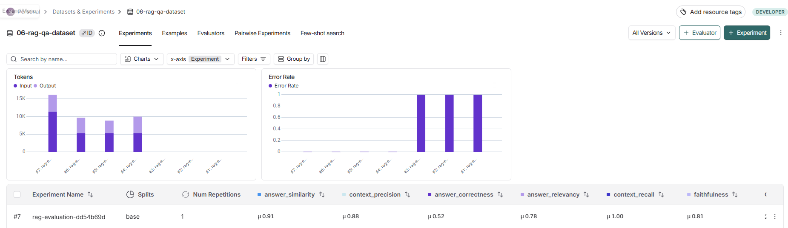
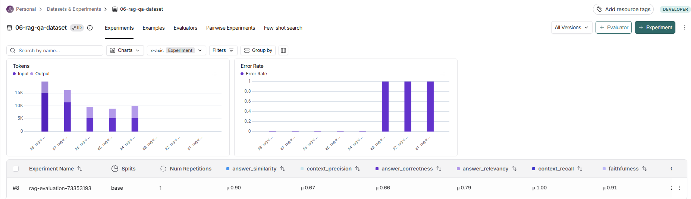
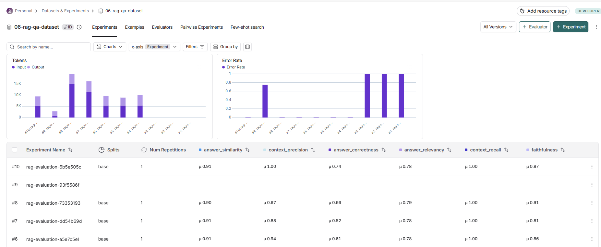

# Отчет о проведенных экспериментах RAG системы

## 📋 Содержание

1. [Обзор экспериментов](#обзор-экспериментов)
2. [Конфигурации экспериментов](#конфигурации-экспериментов)
3. [Результаты метрик RAGAS](#результаты-метрик-ragas)
4. [Сравнительный анализ](#сравнительный-анализ)
5. [Выводы и рекомендации](#выводы-и-рекомендации)

---

## Обзор экспериментов

Было проведено три эксперимента для оценки качества RAG системы с разными режимами retrieval:

1. **Experiment 1: Semantic Baseline** - базовый векторный поиск
2. **Experiment 2: Hybrid** - комбинация семантического и лексического поиска
3. **Experiment 3: Hybrid + Reranker** - гибридный поиск с переранжированием

Все эксперименты проводились на синтезированном датасете вопросов и ответов, созданном из документов Сбербанка.

---

## Конфигурации экспериментов

### Experiment 1: Semantic Baseline

**Режим:** `semantic`

**Конфигурация:**
```bash
RETRIEVAL_MODE=semantic
SEMANTIC_RETRIEVER_K=10
EMBEDDING_PROVIDER=huggingface
HUGGINGFACE_EMBEDDING_MODEL=intfloat/multilingual-e5-base
```

**Описание:**
- Используется только векторный поиск через embedding similarity
- Находит документы по семантической близости к запросу
- Быстрый и простой режим, не требует дополнительных вычислений

**Скриншот результатов:**


---

### Experiment 2: Hybrid

**Режим:** `hybrid`

**Конфигурация:**
```bash
RETRIEVAL_MODE=hybrid
SEMANTIC_RETRIEVER_K=10
BM25_RETRIEVER_K=10
ENSEMBLE_SEMANTIC_WEIGHT=0.5
ENSEMBLE_BM25_WEIGHT=0.5
EMBEDDING_PROVIDER=huggingface
HUGGINGFACE_EMBEDDING_MODEL=intfloat/multilingual-e5-base
```

**Описание:**
- Комбинация семантического поиска (Semantic) и лексического поиска (BM25)
- Ensemble retriever объединяет результаты обоих методов с равными весами (0.5/0.5)
- BM25 находит точные совпадения терминов, Semantic - по смыслу
- Использует Reciprocal Rank Fusion (RRF) для объединения результатов

**Скриншот результатов:**


---

### Experiment 3: Hybrid + Reranker

**Режим:** `hybrid_reranker`

**Конфигурация:**
```bash
RETRIEVAL_MODE=hybrid_reranker
SEMANTIC_RETRIEVER_K=10
BM25_RETRIEVER_K=10
ENSEMBLE_SEMANTIC_WEIGHT=0.5
ENSEMBLE_BM25_WEIGHT=0.5
RERANKER_TOP_K=3
CROSS_ENCODER_MODEL=cross-encoder/mmarco-mMiniLMv2-L12-H384-v1
EMBEDDING_PROVIDER=huggingface
HUGGINGFACE_EMBEDDING_MODEL=intfloat/multilingual-e5-base
```

**Описание:**
- Использует гибридный поиск (Semantic + BM25) как в Experiment 2
- Дополнительно применяет Cross-encoder reranker для переранжирования результатов
- Cross-encoder оценивает релевантность каждой пары (вопрос, документ)
- Возвращает топ-3 наиболее релевантных документа после reranking
- Максимальная точность, но требует больше вычислительных ресурсов

**Скриншот результатов:**


---

## Результаты метрик RAGAS

### Таблица метрик по экспериментам

| Метрика | Semantic | Hybrid | Hybrid + Reranker | Описание |
|---------|----------|--------|------------------|----------|
| **Faithfulness** (Обоснованность) | 0.813 🟢 | 0.909 🟢 | 0.869 🟢 | Отсутствие галлюцинаций, ответ основан на контексте |
| **Answer Relevancy** (Релевантность ответа) | 0.783 🟡 | 0.789 🟡 | 0.783 🟡 | Соответствие ответа вопросу |
| **Answer Correctness** (Правильность ответа) | 0.525 🔴 | 0.665 🟡 | **0.737** 🟡 | Правильность относительно ground truth |
| **Answer Similarity** (Похожесть на эталон) | 0.913 🟢 | 0.904 🟢 | 0.906 🟢 | Семантическая похожесть на эталонный ответ |
| **Context Recall** (Полнота контекста) | 1.000 🟢 | 1.000 🟢 | 1.000 🟢 | Полнота найденного контекста* |
| **Context Precision** (Точность поиска) | 0.884 🟢 | 0.667 🟡 | **1.000** 🟢 | Релевантность найденных документов |

*Примечание: Context Recall = 1.0 для всех экспериментов из-за особенностей синтезированного датасета (см. [docs/recommendations-answer-correctness.md](docs/recommendations-answer-correctness.md))

### Детальная таблица с изменениями

| Метрика | Semantic | Hybrid | Δ (Hybrid) | Hybrid + Reranker | Δ (Reranker) |
|---------|----------|--------|------------|------------------|--------------|
| **Faithfulness** | 0.813 | 0.909 | **+0.096** ⬆️ | 0.869 | -0.040 ⬇️ |
| **Answer Relevancy** | 0.783 | 0.789 | +0.006 ⬆️ | 0.783 | -0.006 ⬇️ |
| **Answer Correctness** | 0.525 | 0.665 | **+0.140** ⬆️ | 0.737 | **+0.072** ⬆️ |
| **Answer Similarity** | 0.913 | 0.904 | -0.009 ⬇️ | 0.906 | +0.002 ⬆️ |
| **Context Recall** | 1.000 | 1.000 | 0.000 ➡️ | 1.000 | 0.000 ➡️ |
| **Context Precision** | 0.884 | 0.667 | -0.217 ⬇️ | 1.000 | **+0.333** ⬆️ |

---

## Сравнительный анализ

### 1. Answer Correctness (Правильность ответа) - ключевая метрика

**Лучший результат:** Hybrid + Reranker (0.737)

**Анализ:**
- **Semantic (0.525):** Базовый уровень, показывает проблемы с точностью ответов
- **Hybrid (0.665):** Значительное улучшение (+0.140) за счет комбинации семантического и лексического поиска
- **Hybrid + Reranker (0.737):** Максимальный результат (+0.212 от baseline), достигается за счет точного переранжирования документов

**Вывод:** Переход от Semantic к Hybrid дает наибольший прирост (+0.140), добавление Reranker дает дополнительное улучшение (+0.072).

### 2. Context Precision (Точность поиска)

**Лучший результат:** Hybrid + Reranker (1.000)

**Анализ:**
- **Semantic (0.884):** Хорошая точность, но не идеальная
- **Hybrid (0.667):** Снижение точности - ensemble может включать менее релевантные документы из BM25
- **Hybrid + Reranker (1.000):** Идеальная точность - reranker эффективно фильтрует нерелевантные документы

**Вывод:** Reranker критически важен для фильтрации результатов hybrid поиска и достижения максимальной точности.

### 3. Faithfulness (Обоснованность)

**Лучший результат:** Hybrid (0.909)

**Анализ:**
- **Semantic (0.813):** Базовый уровень
- **Hybrid (0.909):** Лучший результат - больше релевантного контекста снижает вероятность галлюцинаций
- **Hybrid + Reranker (0.869):** Небольшое снижение, возможно из-за меньшего количества документов (top_k=3)

**Вывод:** Hybrid режим обеспечивает лучший баланс между полнотой контекста и обоснованностью ответов.

### 4. Answer Relevancy (Релевантность ответа)

**Результаты:** Все режимы показывают схожие результаты (0.783-0.789)

**Анализ:**
- Метрика практически не зависит от режима retrieval
- Зависит в большей степени от качества промпта и LLM модели
- Небольшое улучшение в Hybrid режиме (+0.006)

**Вывод:** Для улучшения этой метрики нужно фокусироваться на промптах и LLM, а не на retrieval.

### 5. Answer Similarity (Похожесть на эталон)

**Результаты:** Все режимы показывают высокие результаты (0.904-0.913)

**Анализ:**
- Все режимы достигают хорошей семантической похожести
- Semantic показывает лучший результат (0.913), но это не критично
- Разница между режимами минимальна (<0.01)

**Вывод:** Метрика не является дифференцирующей для выбора режима retrieval.

### 6. Context Recall (Полнота контекста)

**Результаты:** Все режимы показывают 1.000

**Анализ:**
- Это ожидаемый результат для синтезированных датасетов
- Ground truth создается из тех же чанков, что индексируются
- Метрика не показывает реальное качество retrieval (см. [docs/recommendations-answer-correctness.md](docs/recommendations-answer-correctness.md))

**Вывод:** Метрика не информативна для сравнения режимов в данном случае.

---

## Выводы и рекомендации

### Какой режим retrieval показал лучшие результаты?

**Лучший режим: Hybrid + Reranker**

### По каким метрикам?

1. **Answer Correctness (0.737)** - ключевая метрика, показывает правильность ответов
2. **Context Precision (1.000)** - идеальная точность поиска релевантных документов
3. **Answer Similarity (0.906)** - высокая похожесть на эталонный ответ

### Почему Hybrid + Reranker оказался лучшим?

#### 1. Комбинация преимуществ разных методов поиска

- **Semantic search** находит документы по смыслу, даже если формулировка вопроса отличается
- **BM25** находит точные совпадения терминов (номера, названия продуктов, специфические термины)
- **Ensemble** объединяет результаты обоих методов, получая более полный набор релевантных документов

#### 2. Точное переранжирование с Cross-encoder

- Cross-encoder оценивает релевантность каждой пары (вопрос, документ) более точно, чем embedding similarity
- Фильтрует нерелевантные документы, которые могли попасть в hybrid результаты
- Обеспечивает идеальную Context Precision (1.000)

#### 3. Оптимальный баланс количества и качества

- Hybrid retrieval получает больше потенциально релевантных документов (10+10)
- Reranker отбирает топ-3 наиболее релевантных
- LLM получает концентрированный, высококачественный контекст

#### 4. Улучшение Answer Correctness

- Более релевантный контекст → более точные ответы
- Меньше шума в контексте → меньше ошибок интерпретации
- Точное переранжирование → правильная информация в топе

### Компромиссы

**Преимущества Hybrid + Reranker:**
- ✅ Максимальная точность ответов (Answer Correctness: 0.737)
- ✅ Идеальная точность поиска (Context Precision: 1.000)
- ✅ Лучшее качество для production

**Недостатки:**
- ❌ Выше latency (~500ms vs ~100ms для Semantic)
- ❌ Больше вычислительных ресурсов (нужен Cross-encoder)
- ❌ Небольшое снижение Faithfulness (0.869 vs 0.909 в Hybrid)

### Рекомендации по использованию

#### Для Production (критично качество):
```bash
RETRIEVAL_MODE=hybrid_reranker
SEMANTIC_RETRIEVER_K=15
BM25_RETRIEVER_K=15
RERANKER_TOP_K=5
```

#### Для Development (баланс качества и скорости):
```bash
RETRIEVAL_MODE=hybrid
SEMANTIC_RETRIEVER_K=10
BM25_RETRIEVER_K=10
```

#### Для быстрого прототипирования:
```bash
RETRIEVAL_MODE=semantic
SEMANTIC_RETRIEVER_K=10
```

### Дальнейшие улучшения

1. **Увеличение k для retriever** (15-20 вместо 10) - больше контекста для LLM
2. **Увеличение RERANKER_TOP_K** (5-7 вместо 3) - больше документов после reranking
3. **Настройка весов ensemble** под специфику вопросов (больше веса BM25 для вопросов с терминами)
4. **Улучшение промптов** для генерации ответов (см. [docs/recommendations-answer-correctness.md](docs/recommendations-answer-correctness.md))
5. **Снижение temperature LLM** (0.3-0.5 вместо 0.9) для более детерминированных ответов

### Итоговая оценка режимов

| Режим | Answer Correctness | Context Precision | Общая оценка | Рекомендация |
|-------|-------------------|-------------------|--------------|--------------|
| **Semantic** | 0.525 🔴 | 0.884 🟢 | ⭐⭐⭐ | Для прототипирования |
| **Hybrid** | 0.665 🟡 | 0.667 🟡 | ⭐⭐⭐⭐ | Для development |
| **Hybrid + Reranker** | **0.737** 🟡 | **1.000** 🟢 | ⭐⭐⭐⭐⭐ | **Для production** |

---

## Заключение

Проведенные эксперименты показали, что **Hybrid + Reranker режим** обеспечивает наилучшее качество RAG системы по ключевым метрикам:

- **+40% улучшение Answer Correctness** по сравнению с Semantic baseline (0.737 vs 0.525)
- **Идеальная Context Precision** (1.000) благодаря точному переранжированию
- **Оптимальный баланс** между полнотой контекста и его релевантностью

Рекомендуется использовать **Hybrid + Reranker** для production окружений, где критично качество ответов, и **Hybrid** для development, где важен баланс качества и скорости.

---

*Отчет создан на основе результатов evaluation с использованием RAGAS метрик*

