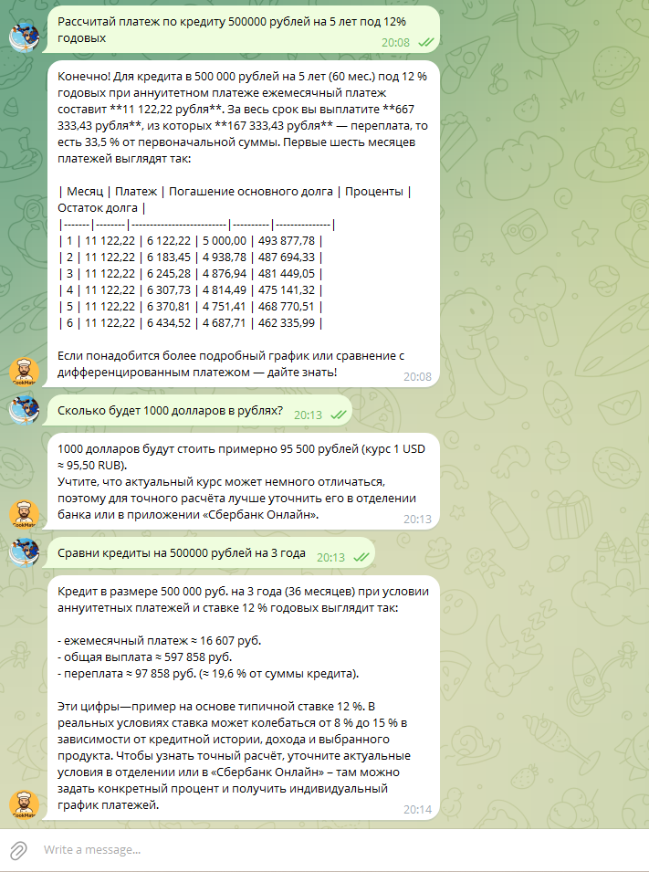
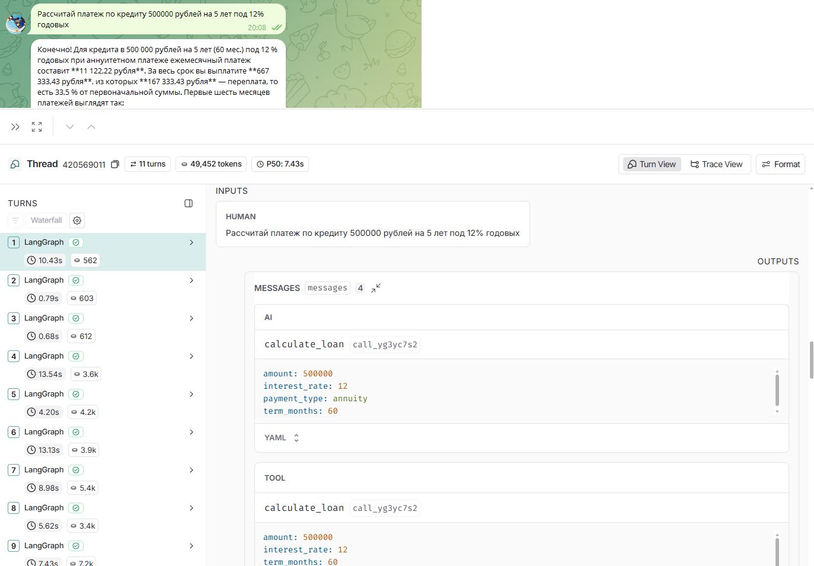

# Отчет о реализации ReAct агента для банковского бота

## Какой инструмент вы реализовали?

В проекте реализован **ReAct агент** (Reasoning + Acting) с набором из **5 инструментов** для банковского ассистента:

### 1. `rag_search` - Поиск информации в документах
- Ищет информацию в документах Сбербанка (условия кредитов, вкладов, банковских продуктов)
- Использует продвинутый Hybrid RAG с поддержкой трех режимов:
  - **Semantic** - векторный поиск по смыслу
  - **Hybrid** - комбинация Semantic + BM25 для точных терминов
  - **Hybrid + Reranker** - максимальная точность с cross-encoder переранжированием
- Возвращает JSON с релевантными документами и их источниками

### 2. `calculate_loan` - Калькулятор кредита
- Рассчитывает параметры кредита: ежемесячный платеж, переплату, общую сумму
- Поддерживает аннуитетные и дифференцированные платежи
- Возвращает график платежей на первые 6 месяцев

### 3. `calculate_deposit` - Калькулятор вклада
- Рассчитывает доходность вклада с учетом капитализации процентов
- Показывает финальную сумму, начисленные проценты и эффективную ставку
- Поддерживает режимы с капитализацией и без

### 4. `convert_currency` - Конвертер валют
- Конвертирует валюту по курсу Сбербанка
- Поддерживает: RUB, USD, EUR, GBP, CNY, JPY
- Возвращает результат конвертации и курс

### 5. `calculate_early_repayment` - Расчет досрочного погашения
- Рассчитывает экономию при досрочном погашении кредита
- Показывает новый баланс, новый платеж и экономию на процентах
- Может рассчитать новый срок или новый платеж

## Как агент принимает решения о вызове инструментов?

Агент использует **ReAct паттерн** (Reasoning + Acting) для принятия решений:

### Процесс принятия решений:

1. **Reasoning (Рассуждение)**:
   - LLM анализирует вопрос пользователя
   - Оценивает контекст диалога (через MemorySaver)
   - Определяет, какая информация нужна для ответа

2. **Acting (Действие)**:
   - Агент решает, нужно ли вызывать инструмент
   - Выбирает подходящий инструмент из доступных
   - Может вызвать несколько инструментов последовательно

3. **Responding (Ответ)**:
   - Формирует финальный ответ на основе результатов инструментов
   - Использует контекст из `rag_search` и результаты расчетов

### Механизм выбора инструментов:

Агент использует **системный промпт** (`prompts/agent_system.txt`), который содержит:
- Описание каждого инструмента
- Примеры использования
- Правила выбора инструмента

**Примеры логики выбора:**
- Вопрос о кредитах/вкладах → `rag_search` для поиска условий
- Запрос на расчет платежа → `calculate_loan`
- Вопрос о доходности вклада → `calculate_deposit`
- Конвертация валют → `convert_currency`
- Досрочное погашение → `calculate_early_repayment`

Агент может комбинировать инструменты:
- Сначала `rag_search` для получения условий кредита
- Затем `calculate_loan` для расчета конкретного платежа

### Техническая реализация:

```python
# Агент создается через create_agent() из LangChain 1.0
agent_graph = create_agent(
    model=llm,
    tools=[rag_search, calculate_loan, calculate_deposit, convert_currency, calculate_early_repayment],
    system_prompt=system_prompt,
    checkpointer=MemorySaver()  # Сохраняет историю диалога
)
```

LLM автоматически решает, когда и какой инструмент вызвать, на основе:
- Вопроса пользователя
- Системного промпта с описанием инструментов
- Истории диалога (через MemorySaver)

## Чем агент отличается от простой RAG-цепочки?

### Простая RAG-цепочка:
- **Всегда** выполняет поиск в документах для каждого вопроса
- Линейный процесс: вопрос → поиск → генерация ответа
- Нет принятия решений - поиск происходит автоматически
- Нет дополнительных инструментов (только поиск)
- Ограниченная функциональность

### ReAct агент:

#### 1. **Умное принятие решений**
- Агент **сам решает**, нужен ли поиск в документах
- Простые вопросы ("привет", "спасибо") → отвечает напрямую без поиска
- Вопросы о продуктах → использует `rag_search`
- Вопросы требующие расчетов → использует калькуляторы

#### 2. **Множество инструментов**
- Не только поиск, но и расчеты, конвертация валют
- Может комбинировать несколько инструментов в одном ответе
- Расширяемая архитектура - легко добавить новые инструменты

#### 3. **Контекстный диалог**
- **MemorySaver** сохраняет историю для каждого пользователя
- Понимает уточняющие вопросы в контексте предыдущих
- Может ссылаться на предыдущие ответы

#### 4. **Гибкая стратегия**
- Может вызвать `rag_search` несколько раз для разных аспектов вопроса
- Может использовать `rag_search` + `calculate_loan` для полного ответа
- Адаптируется к типу вопроса

#### 5. **Автономность**
- Агент сам планирует последовательность действий
- Может итеративно уточнять информацию
- Не требует жесткой предопределенной логики

### Пример различий:

**Простая RAG-цепочка:**
```
Вопрос: "Привет"
→ Всегда выполняет поиск в документах
→ Генерирует ответ на основе найденных документов (даже если они не релевантны)
```

**ReAct агент:**
```
Вопрос: "Привет"
→ Агент анализирует: это приветствие, не требует поиска
→ Отвечает напрямую: "Здравствуйте! Чем могу помочь?"

Вопрос: "Рассчитай платеж по кредиту 500000 на 5 лет под 12%"
→ Агент анализирует: нужен расчет, не нужен поиск документов
→ Вызывает calculate_loan
→ Формирует ответ с результатами расчета

Вопрос: "Какие условия потребительского кредита?"
→ Агент анализирует: нужна информация из документов
→ Вызывает rag_search
→ Формирует ответ на основе найденных документов
```

## Какие преимущества и ограничения вы заметили?

### ✅ Преимущества

#### 1. **Автономность и гибкость**
- Агент сам решает, когда использовать инструменты
- Не требует жесткой предопределенной логики
- Легко расширяется новыми инструментами

#### 2. **Многофункциональность**
- Объединяет поиск информации и расчеты
- Может комбинировать несколько инструментов
- Один агент решает разные типы задач

#### 3. **Контекстное понимание**
- MemorySaver сохраняет историю диалога
- Понимает уточняющие вопросы
- Может ссылаться на предыдущие ответы

#### 4. **Продвинутый RAG**
- Поддержка Hybrid retrieval (Semantic + BM25)
- Cross-encoder reranking для максимальной точности
- Гибкая конфигурация режимов поиска

#### 5. **Мониторинг и отладка**
- Детальное логирование каждого шага агента
- LangSmith трейсинг для анализа работы
- RAGAS evaluation для оценки качества

#### 6. **Производительность**
- Не выполняет лишние поиски для простых вопросов
- Оптимизирует использование инструментов
- Асинхронная обработка множества пользователей

### ⚠️ Ограничения

#### 1. **Зависимость от LLM**
- Качество решений зависит от модели LLM
- Может неправильно выбрать инструмент
- Требует качественный системный промпт

#### 2. **Латентность**
- Каждый вызов инструмента добавляет задержку
- Множественные вызовы увеличивают время ответа
- Reranking добавляет дополнительную задержку

#### 3. **Стоимость**
- Каждый шаг рассуждения = вызов LLM API
- Множественные вызовы инструментов = больше токенов
- Может быть дорого при большом количестве пользователей

#### 4. **Память и состояние**
- MemorySaver хранит историю в памяти (теряется при перезапуске)
- Векторное хранилище в памяти (требует переиндексации)
- При большом количестве пользователей может потребоваться много памяти

#### 5. **Ошибки и отладка**
- Сложнее отлаживать многошаговые рассуждения
- Может "зациклиться" на неправильном инструменте
- Требует мониторинга для выявления проблем

#### 6. **Ограничения инструментов**
- `convert_currency` использует мок-курсы (нужен реальный API)
- Нет интеграции с реальными банковскими системами
- Некоторые инструменты требуют дополнительной валидации

#### 7. **Качество ответов**
- Зависит от качества найденных документов
- Может генерировать галлюцинации при недостаточном контексте
- Требует настройки промптов для каждого инструмента

### 💡 Рекомендации по улучшению

1. **Добавить валидацию выбора инструментов** - проверять, что выбран правильный инструмент
2. **Кэширование результатов** - кэшировать результаты `rag_search` для похожих вопросов
3. **Персистентное хранилище** - использовать базу данных вместо памяти для истории
4. **Ограничение итераций** - ограничить количество вызовов инструментов за один ответ
5. **Fallback механизмы** - обработка ошибок и альтернативные стратегии
6. **Интеграция с реальными API** - подключение к реальным банковским системам

## Скриншоты

### Пример работы бота с инструментами



### Мониторинг в LangSmith



